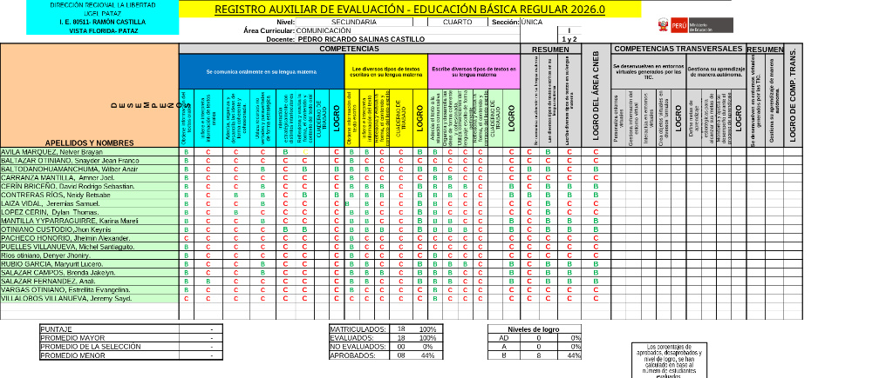

### 🤖 Usar IA para generar conclusiones descriptivas


Hacer conclusiones descriptivas una por una puede tomar MUCHÍSIMO tiempo.  
Y peor todavía cuando tenemos **síndrome del trasero muerto**.

La buena noticia es que ahora podemos usar inteligencia artificial para ayudarnos con eso 👀✨

Y no… no significa que la IA hará todo sola.  
La idea es usarla como apoyo para avanzar más rápido.

---

### 📝 Paso 1: Copiar las notas del registro

Primero necesitamos copiar la información de los estudiantes como imagen o como datos.

Puede ser:
- notas,
- competencias,
- observaciones,
- fortalezas,
- dificultades,
- o cualquier dato del registro auxiliar.

Por ejemplo 👇



---

### 🤖 Paso 2: Enviar el texto a la IA

Ahora copiamos esa información y se la enviamos a la IA con una instrucción clara.

Por ejemplo 👇

```txt
Genera las conclusiones descriptivas
 usando cada una de las competencias
 para cada uno de los estudiantes 
 en una o dos oraciones
 y genera un archivo descargable Excel
```

Y listo 😎

La IA puede ayudarte a:

* redactar mejor,
* ordenar ideas,
* usar un tono más claro,
* y hasta generar documentos descargables.

---

# ✨ Ejemplo de resultado

La IA podría responder algo así:

> El estudiante demuestra un buen desempeño en las diferentes áreas, participando activamente y comprendiendo con facilidad los contenidos trabajados en clase. Destaca en la resolución de problemas y muestra autonomía en sus actividades. Se recomienda continuar fortaleciendo la organización personal y la entrega oportuna de tareas para seguir mejorando su desempeño académico.

Nada mal si👀

---

