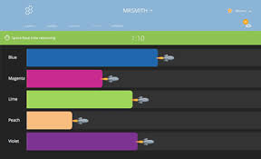

Socrative es una plataforma educativa digital que permite a los docentes crear actividades interactivas, evaluaciones y cuestionarios en tiempo real. 

Los estudiantes pueden responder desde celulares, tablets o computadoras utilizando un código de sala. La herramienta ayuda a verificar la comprensión de los estudiantes de manera rápida y dinámica, permitiendo que los docentes obtengan los resultados de manera inmediata. Socrative puede utilizarse tanto en clases presenciales como virtuales.

### Como usar 
- puede ver el video (https://www.youtube.com/test)
- o puedes usar [Google](https://google.com) para verificar los resultados
- Los resultados se pueden descargar para analizar el avance de cada estudiante 
- Los resultados se pueden descargar para analizar el avance de cada estudiante 
- Los resultados se pueden descargar para analizar el avance de cada estudiante 
- Los resultados se pueden descargar para analizar el avance de cada estudiante 

### Necesidades obligatorias
- cuenta de docente en socrative
- acceso a internet
- computadora, laptop, tablet o celular
- Navegador actualizado.

### Trabajos
- socrative se recomienda usar en estudiantes desde 4to de primaria.
- realizar preguntas cortas y juegos educativos.
- util para realizar evaluaciones rapidas, prcaticas y participacion en clases, aunque para esto hay otras herramientas como [kahoot](/kahoot.md)
- permite el analizis rapido de los aprendizajes

### Recomendaciones
#### Antes de la clase
- probar previamente la actividad
- verificar la conexion a internet

#### durante la claso
- utilizar actividades cortas para mantener la atencion
- combinar preguntas teoricas y practicas.

#### despue de la clase
- descargar y analizar los resultados obtenidos

- retromalimentar a los estudiantes

### Problemas Frecuentes
| Problema  | Posible causa | 
|---|---|
| los estudiantes no pueden ingresar  | el codigo ingresado es incorrecto |
| los estudiantes se distraen   | el tiempo del examen es largo y las preguntas tienen  un tiempo muy largo, cambiar el estilo de las preguntas cambiando interfazes o agregando imagenes |

