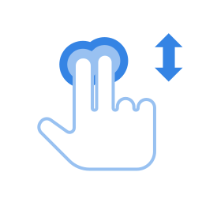
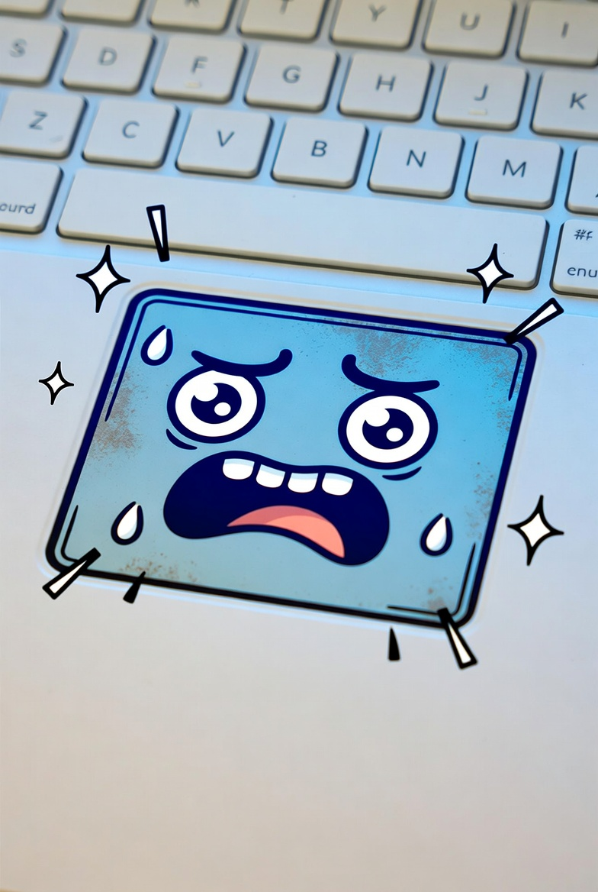

### Trucos del Touchpad 🖱️

El touchpad... ese cuadrito que esta debajo del teclado. También conocido como panel táctil o como dirían algunos: *“maypi dedoykita churanaykipaq”*.

Muchos lo usamos todos los días, pero casi siempre solo para mover el cursor y hacer clic. Y recién nos acordamos de él cuando empieza a fallar.

Pero ojo 👀… el touchpad puede hacer MUCHAS cosas que nos ayudan a trabajar más rápido sin necesidad de usar mouse.

Por ejemplo…

### 📜 Bajar y subir rápido en Word o internet

Seguro alguna vez dijiste:

> “¿Y ahora cómo hago scroll si no tengo ruedita?”

Fácil 👇

Solo pon **dos dedos** sobre el touchpad y deslízalos hacia arriba o abajo.

Así puedes:
- bajar páginas en Word
- revisar PDFs
- navegar en internet
- Agregar nueva habilidad a esos dedasos.

---

Estos son los movimientos más prácticos que vale la pena aprender:

| Gesto | ¿Qué hace? |
|---|---|
| Dos dedos arriba o abajo | Subir o bajar páginas |
| Dos dedos hacia los lados | Moverse horizontalmente |
| Pellizcar con dos dedos | Acercar o alejar zoom |
| Dos dedos y tocar | Clic derecho |
| Tres dedos hacia arriba | Ver todas las ventanas abiertas |
| Tres dedos hacia abajo | Mostrar el escritorio |
| Tres dedos a los lados | Cambiar entre programas |
| Cuatro dedos a los lados | Cambiar de escritorio virtual |
| Un toque | Clic normal |
| Doble toque | Abrir archivos o carpetas |
| Mantener y mover | Arrastrar archivos |

---

### 😵 “Profe, no funciona…”

Si alguno de estos movimientos no responde, puede ser porque esta muy SUCIO!!!. 

pero sino aca hay algunas alternativas:

| Problema | Posible causa | Qué puedes hacer |
|---|---|---|
| Los gestos no funcionan | Touchpad deshabilitado | Activarlo desde Configuración o con la tecla `Fn` |
| No funciona el scroll con dos dedos | Gestos apagados | Activarlos en Configuración |
| El cursor va muy lento | Sensibilidad baja | Subir la velocidad del puntero |
| Algunos gestos no aparecen | Windows o drivers antiguos | Actualizar el sistema |
| El touchpad dejó de funcionar | Error temporal | Reiniciar la laptop |

---

### ⚙️ Cómo activar los gestos

1. Abrir **Configuración**
2. Entrar a **Bluetooth y dispositivos**
3. Buscar **Touchpad**
4. Activar:
   - desplazamiento con dos dedos,
   - gestos con tres dedos,
   - zoom con pellizco.

---

El touchpad no solo sirve para mover la flechita. Aprender estos gestos puede ayudarte bastante en clases virtuales, preparación de sesiones, uso de Word, Canva, Zoom, Meet y muchas otras cosas del día a día.

Y sí… después de acostumbrarte, hasta flojera da volver al mouse, dijo nadie.

